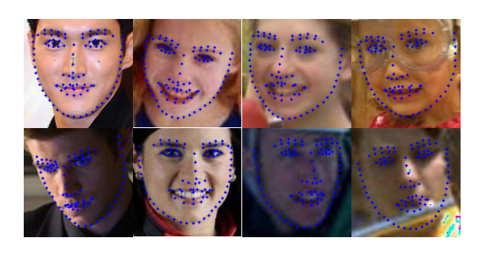

# PFLD-pytorch

## 환경설정-conda
* adafuse, adafuse-demo, gast, pfld, pfld68 모두 동일
* 위의 repository안에는  hee_env.yaml 파일 존재
* 명령어로 파일을 import하여 conda 환경 설정
```
conda env create -f hee_env.yaml 
conda activate hee
```
* 혹시 glfw관련 에러가 발생 시, 아래 명령어 추가 실행 
```
apt-get update
apt-get install libglfw3-dev
```

## Pretrained Models
아래처럼 pretrained model을 준비할 것

* Way1: 119서버 /data1/hee/weights 폴더 안에 아래 이름과 동일한 파일들을 다운로드 후, 알맞은 위치로 옮기기

* Way2: google drive 캐릭터 팀 폴더/장희오-인수인계/weights 폴더 안에 아래 이름과 동일한 파일들을 다운로드 후, 알맞은 위치로 옮기기

```
${pfld_ROOT}
└── checkpoint
    ├── snapshot
        ├── checkpoint_pfld.pth.tar
```

## 데이터 준비

* 어렵게 하고 싶다면, 원저자가 아래에 적어놓은대로 따라서 하면 됨

* 쉽게 하고 싶다면, 119서버 /data1/hee/pfld/data 폴더 안의 것들을 {pfld-project}/data 아래로 옮겨주면 됨

* 학습/평가시 path에 의한 문제가 없도록 수정하였으나, 만일 발생시 다음을 참고할 것

 ```
{pfld-project}/data/train_data/list.txt

{pfld-project}/data/test_data/list.txt

{pfld-project}/dataset/datasets.py 의 168번째 줄 
```


## Demo 돌리기

얼굴 위에 landmark 표현
```
python camera.py
```

## train/Eval 돌리기

학습
```
python train.py
```

평가
```
python test.py
```


## 원본 내용

Implementation of  PFLD A Practical Facial Landmark Detector by pytorch.

#### 1. install requirements

~~~shell
pip3 install -r requirements.txt
~~~

#### 2. Datasets

- **WFLW Dataset Download**

​    [Wider Facial Landmarks in-the-wild (WFLW)](https://wywu.github.io/projects/LAB/WFLW.html) is a new proposed face dataset. It contains 10000 faces (7500 for training and 2500 for testing)  with 98 fully manual annotated landmarks.

1. WFLW Training and Testing images [[Google Drive](https://drive.google.com/file/d/1hzBd48JIdWTJSsATBEB_eFVvPL1bx6UC/view?usp=sharing)] [[Baidu Drive](https://pan.baidu.com/s/1paoOpusuyafHY154lqXYrA)]
2. WFLW  [Face Annotations](https://wywu.github.io/projects/LAB/support/WFLW_annotations.tar.gz)
3. Unzip above two packages and put them on `./data/WFLW/`
4. move `Mirror98.txt` to `WFLW/WFLW_annotations`

~~~shell
$ cd data 
$ python3 SetPreparation.py
~~~

#### 3. training & testing

training :

~~~shell
$ python3 train.py
~~~
use tensorboard, open a new terminal
~~~
$ tensorboard  --logdir=./checkpoint/tensorboard/
~~~
testing:

~~~shell
$ python3 test.py
~~~

#### 4. results:



#### 5. pytorch -> onnx -> ncnn

**Pytorch -> onnx**

~~~~shell
python3 pytorch2onnx.py
~~~~

**onnx -> ncnn**

how to build :https://github.com/Tencent/ncnn/wiki/how-to-build

~~~shell
cd ncnn/build/tools/onnx
./onnx2ncnn pfld-sim.onnx pfld-sim.param pfld-sim.bin
~~~

Now you can use **pfld-sim.param** and **pfld-sim.bin** in ncnn:

~~~cpp
ncnn::Net pfld;
pfld.load_param("path/to/pfld-sim.param");
pfld.load_model("path/to/pfld-sim.bin");

cv::Mat img = cv::imread(imagepath, 1);
ncnn::Mat in = ncnn::Mat::from_pixels_resize(img.data, ncnn::Mat::PIXEL_BGR, img.cols, img.rows, 112, 112);
const float norm_vals[3] = {1/255.f, 1/255.f, 1/255.f};
in.substract_mean_normalize(0, norm_vals);

ncnn::Extractor ex = pfld.create_extractor();
ex.input("input_1", in);
ncnn::Mat out;
ex.extract("415", out);
~~~

#### 6. reference: 

 PFLD: A Practical Facial Landmark Detector https://arxiv.org/pdf/1902.10859.pdf

Tensorflow Implementation: https://github.com/guoqiangqi/PFLD

